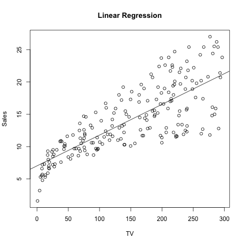

library(captioner)

<h1 align = "center"> Simple Regression Analysis </h1>

 <i> Priscilla Hartono </i> 

 <i> October 7th, 2016 </i> 

### Abstract

This paper is the second homework of STAT 159, Reproducible and Collaborative Statistical Data Science, taught by Professor Gaston Sanchez in the fall of 2016 at UC Berkeley.

A reproduction of the analysis found under section 3.1 of "An Introduction to Statistical Learning" (by James et al), can be found below.

Link to the book:

	http://www-bcf.usc.edu/~gareth/ISL/

Link to dataset used:

	http://www-bcf.usc.edu/~gareth/ISL/Advertising.csv

### Introduction

### Data

### Methodology

### Results

### Conclusion
